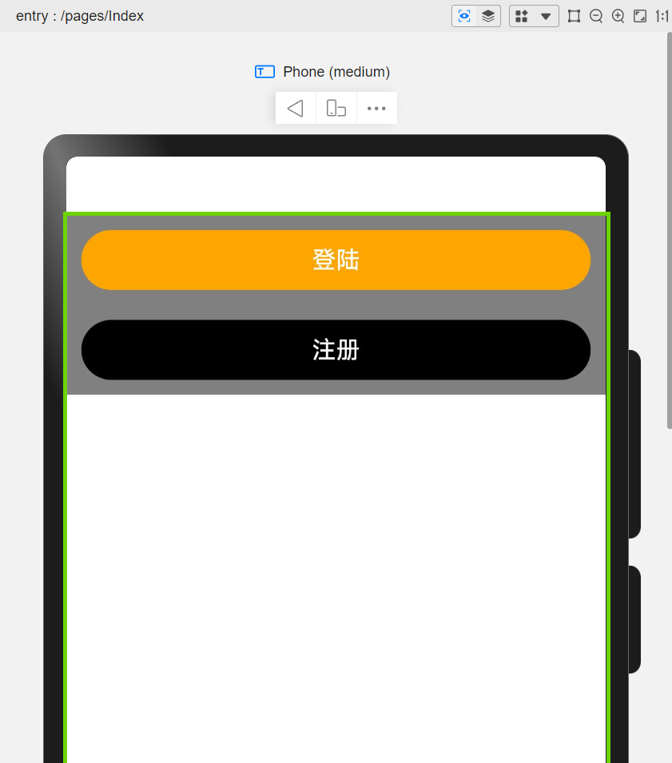

## 内外边距

### 1. 内边距

`padding(数据)`

### 2. 外边距

`margin(数据)`

### 3. 四个方向向量

* top：顶部
* bottom：底部
* left：左侧
* right：右侧

### 4. 实操

页面呈现：


```
@Entry
@Component
struct Index {
    build() {
        Column() {
            Column() {
                Button("登陆")
                    .width("100%")
                    .height(40)
                    .margin({
                        top: 0,
                        right: 10,
                        bottom: 10,
                        left: 10
                    })
                    .backgroundColor(Color.Orange)

                Button("注册")
                    .width("100%")
                    .height(40)
                    .margin({ top: 10 })
                    .backgroundColor(Color.Black)

            }
            .width("100%")
            .height(120)
            .backgroundColor(Color.Grey)
            .padding(10)
        }
    }
}
```