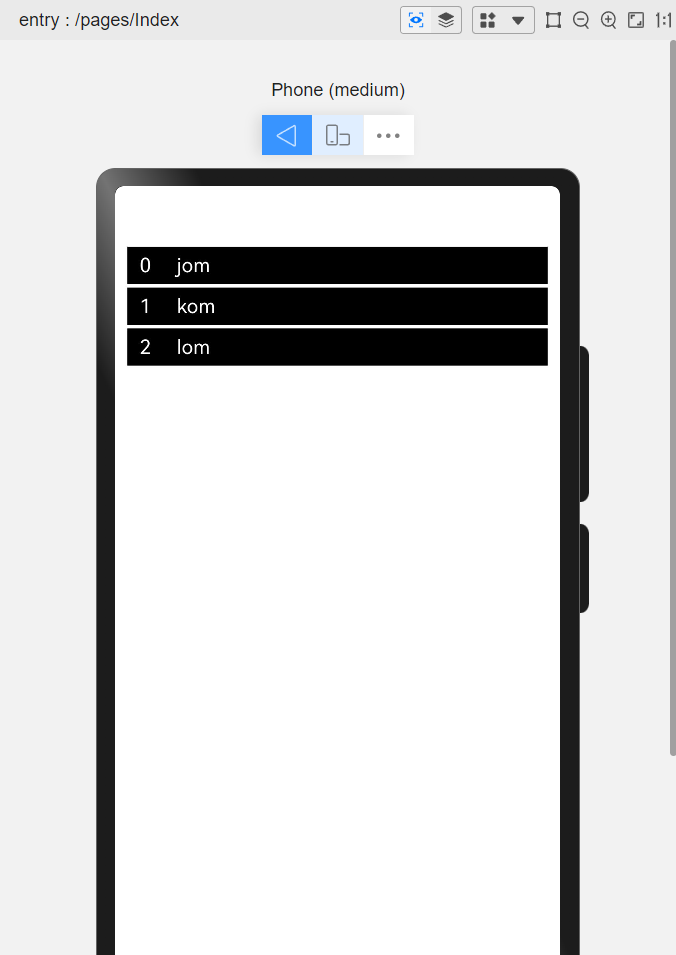

## 循环渲染 `ForEach`

### 结果展示



### 代码使用

```
let nums: string[] = ["jom", "kom", "lom"]

@Entry
@Component
struct Index {
    build() {
        /*
         * ForEach(数组,(item:类型,index:number)=>{
         *      组件
         * })
         *
         * */
        Column() {
            Column() {
                ForEach(nums, (name: string, index: number) => {
                    Row() {
                        Text(String(index))
                            .fontColor(Color.White)
                            .width(30)
                        Text(name)
                            .fontColor(Color.White)
                    }
                    .width("100%")
                    .height(30)
                    .backgroundColor(Color.Black)
                    .padding({ left: 10 })
                    .margin({ bottom: 3 })
                })
            }
        }
        .padding(10)
    }
}
```
