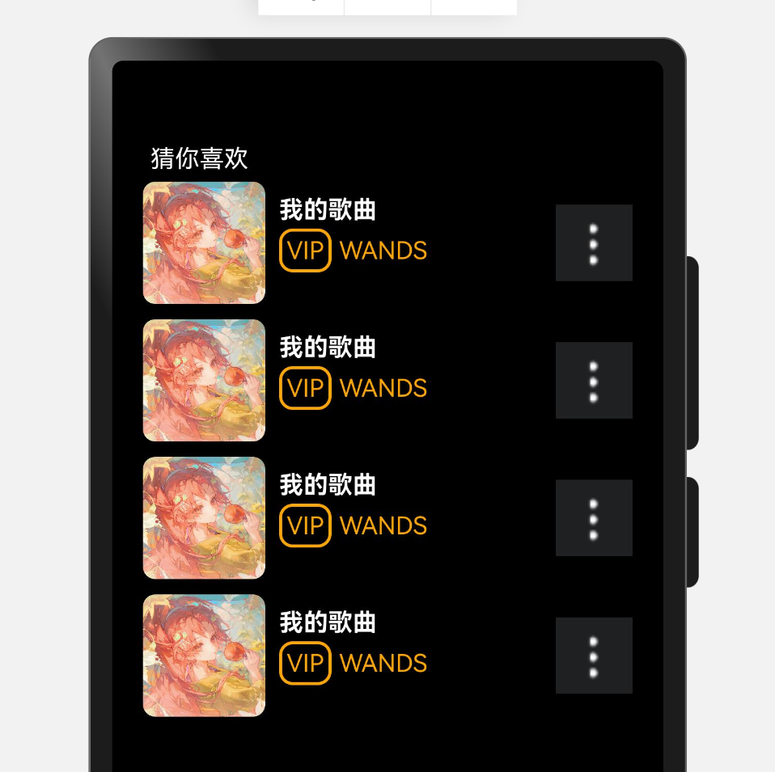

## 要求

### 1. 效果展示



### 2. 代码

```
import text from '@ohos.graphics.text'

@Entry
@Component
struct Index {
    build() {
        Column() {
            Text("猜你喜欢")
                .fontColor(Color.White)
                .textAlign(TextAlign.Start)
                .fontColor(Color.White)
                .width("100%")
                .height(30)
                // .backgroundColor(Color.Red)
                .padding({ left: 5 })
            List() {
                ListItem() {
                    Row() {
                        // 图
                        Image($r("app.media.ex1"))
                            .width(80)
                            .height(80)
                            .border({ radius: 8 })
                        // 字
                        Column() {
                            Row() {
                                Text("我的歌曲")
                                    .fontColor(Color.White)
                                    .width("100%")
                                    .fontWeight(700)
                            }

                            Row() {
                                Text("VIP")
                                    .fontColor(Color.Orange)
                                    .border({
                                        width: 2,
                                        radius: 9,
                                        color: Color.Orange
                                    })
                                    .padding(3)
                                    .margin({ right: 5 })
                                Text("WANDS")
                                    .fontColor(Color.Orange)
                            }
                            .width("100%")
                            .margin({ top: 3 })
                        }
                        .height(80)
                        // 根据顺序，占取所有剩余的位置
                        .layoutWeight(1)
                        .padding(9)

                        // 更多
                        Image($r("app.media.ex000"))
                            .width(50)
                            .height(50)
                    }
                    .width("100%")
                    .height(80)
                    .margin({ bottom: 10 })
                }

                ListItem() {
                    Row() {
                        // 图
                        Image($r("app.media.ex1"))
                            .width(80)
                            .height(80)
                            .border({ radius: 8 })
                        // 字
                        Column() {
                            Row() {
                                Text("我的歌曲")
                                    .fontColor(Color.White)
                                    .width("100%")
                                    .fontWeight(700)
                            }

                            Row() {
                                Text("VIP")
                                    .fontColor(Color.Orange)
                                    .border({
                                        width: 2,
                                        radius: 9,
                                        color: Color.Orange
                                    })
                                    .padding(3)
                                    .margin({ right: 5 })
                                Text("WANDS")
                                    .fontColor(Color.Orange)
                            }
                            .width("100%")
                            .margin({ top: 3 })
                        }
                        .height(80)
                        // 根据顺序，占取所有剩余的位置
                        .layoutWeight(1)
                        .padding(9)

                        // 更多
                        Image($r("app.media.ex000"))
                            .width(50)
                            .height(50)
                    }
                    .width("100%")
                    .height(80)
                    .margin({ bottom: 10 })
                }

                ListItem() {
                    Row() {
                        // 图
                        Image($r("app.media.ex1"))
                            .width(80)
                            .height(80)
                            .border({ radius: 8 })
                        // 字
                        Column() {
                            Row() {
                                Text("我的歌曲")
                                    .fontColor(Color.White)
                                    .width("100%")
                                    .fontWeight(700)
                            }

                            Row() {
                                Text("VIP")
                                    .fontColor(Color.Orange)
                                    .border({
                                        width: 2,
                                        radius: 9,
                                        color: Color.Orange
                                    })
                                    .padding(3)
                                    .margin({ right: 5 })
                                Text("WANDS")
                                    .fontColor(Color.Orange)
                            }
                            .width("100%")
                            .margin({ top: 3 })
                        }
                        .height(80)
                        // 根据顺序，占取所有剩余的位置
                        .layoutWeight(1)
                        .padding(9)

                        // 更多
                        Image($r("app.media.ex000"))
                            .width(50)
                            .height(50)
                    }
                    .width("100%")
                    .height(80)
                    .margin({ bottom: 10 })
                }

                ListItem() {
                    Row() {
                        // 图
                        Image($r("app.media.ex1"))
                            .width(80)
                            .height(80)
                            .border({ radius: 8 })
                        // 字
                        Column() {
                            Row() {
                                Text("我的歌曲")
                                    .fontColor(Color.White)
                                    .width("100%")
                                    .fontWeight(700)
                            }

                            Row() {
                                Text("VIP")
                                    .fontColor(Color.Orange)
                                    .border({
                                        width: 2,
                                        radius: 9,
                                        color: Color.Orange
                                    })
                                    .padding(3)
                                    .margin({ right: 5 })
                                Text("WANDS")
                                    .fontColor(Color.Orange)
                            }
                            .width("100%")
                            .margin({ top: 3 })
                        }
                        .height(80)
                        // 根据顺序，占取所有剩余的位置
                        .layoutWeight(1)
                        .padding(9)

                        // 更多
                        Image($r("app.media.ex000"))
                            .width(50)
                            .height(50)
                    }
                    .width("100%")
                    .height(80)
                    .margin({ bottom: 10 })
                }
            }
        }
        // 宽、高、背景色设置
        .width("100%")
        .height("100%")
        .backgroundColor(Color.Black)
        // 扩充组件安全区域
        .expandSafeArea([SafeAreaType.SYSTEM], [SafeAreaEdge.TOP, SafeAreaEdge.BOTTOM])
        // 内边距
        .padding({
            top: 10,
            right: 20,
            bottom: 10,
            left: 20,
        })
    }
}
```